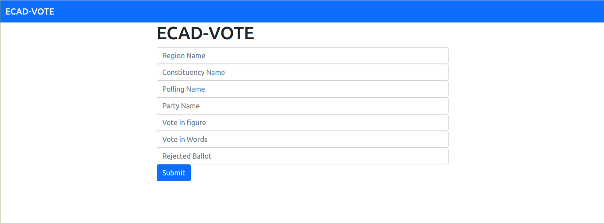
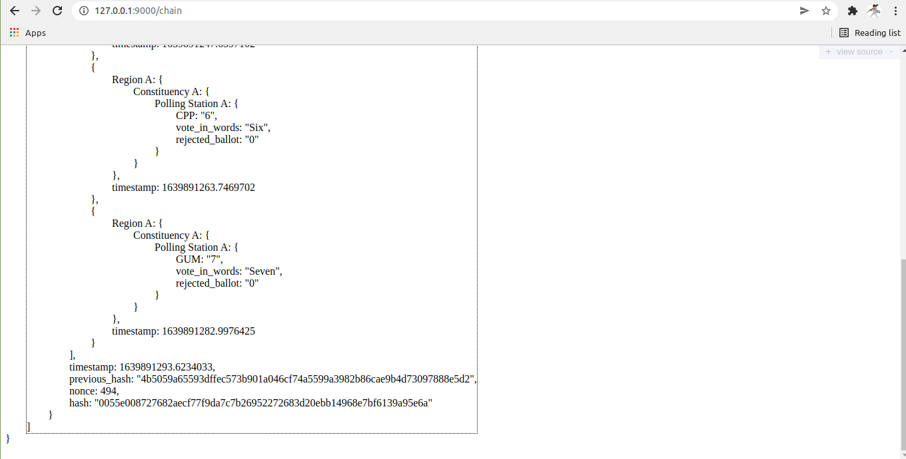
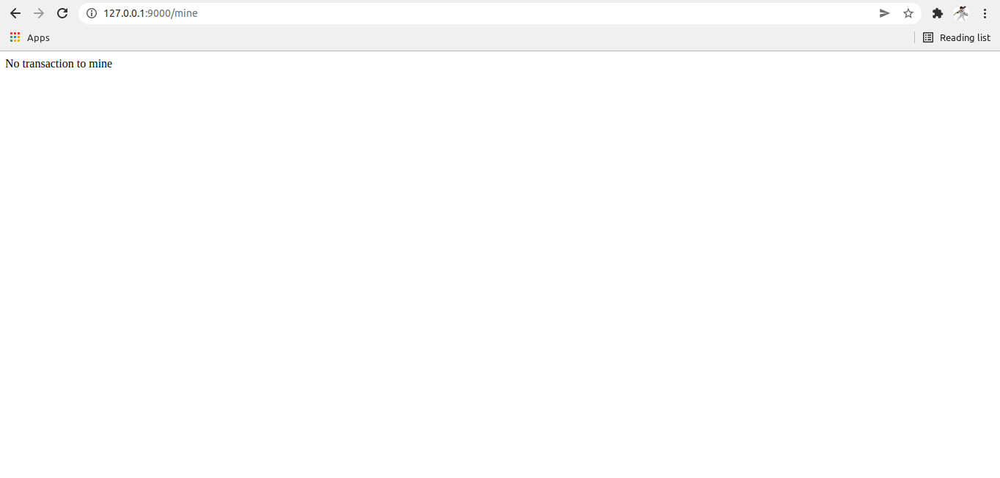
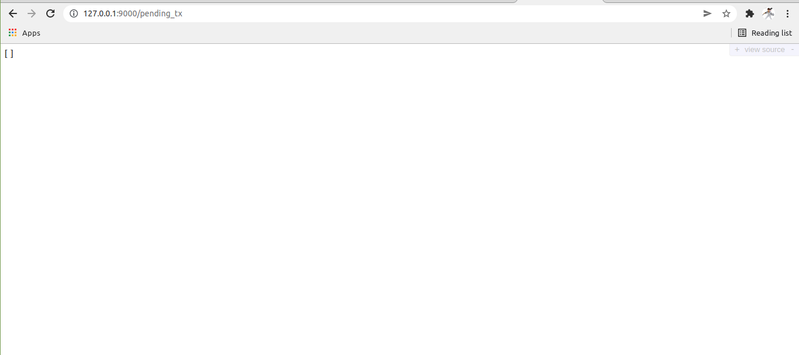

## SECURING VOTING USING BLOCKCHAIN
This is the blockchain backend.  
This part makes it possible for a user to send data to the blockchain via web interface. 
The backend has the blockchain side and a flask side. The purpose of the flask side is to 
link the html web interface to the blockchain so that data can be added to the BC. 
Also the flask enables us to create a usable API that can be parse by anyone who is authorize to use 
the data from the blockchain for a perticular purpose.

### CURRENT STATE OF THIS API
* FRONT END TO FOR THE BLOCKCHAIN
     
    This enables a user to communicate with the block system. 
    A user thus (EC officer) will have to enter all the available fields to send data to the BC system.  
* URL TO SEE DATA IN THE BLOCK
     
    With this URL the person handling the BC system can see the data in the BC.
    This same URL is what will be used by a developer to parse data from the BC.  

* URL TO MINE THE BC
     
    Before any data can be added to the BC it has to be mined. 
    This URL must be refresh to mine the data to the BC. We could allow auto refresh of that URL but due to memory issues we decided to do that manuelly. 

* URL TO CHECK DATA THAT ARE NOT MINE TO THE BC
     
    The person handling the BC system can check for unmined data to the BC, and mine them if they like.
